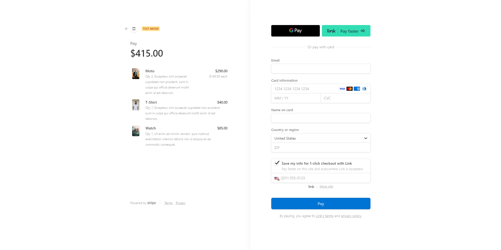

<h1 align="center">Online Store</h1>

<p align="center">
Responsive online store with cart preview and checkout session and user authentication.</a></p>


## Links

- [Repo](https://github.com/kelseychristensen/Day-96-Online-Shop "online-shop")

## Screenshots

#### Homepage with Active States

#### Viewing Item Details // Item Page

#### Adding Item to Cart 

#### Cart Preview // Removing Items from Cart 

#### Stripe Checkout Session

#### Login Page

#### Registration Page

#### Visiting Cart When Empty 

#### Success

#### Cancel


### Built with

- HTML
- CSS
- Python
- Flask
- Bootstrap
- WTForms 
- Jinja
- SQL
- Stripe API

### What went into this project

This is a functioning online store using Stripe API. 

Users can view the store's products, more details about each product, add products to their cart, remove items from their cart, preview their cart, and check out.

Registration and logging in is required to checkout and users are alerted if they have an existing account. 

Users can always see how many items are in their cart by using the feedback in the navbar. The navbar will also change depending on whether the user is logged in.

Styling is assisted by Bootstrap and Jinja templating. 

### Continued development

Some finishing touches would be more responsiveness and a cart total in the preview area.

```python
@app.route('/product/<int:item_id>', methods=['GET'])
def show_item(item_id):
    prices = []
    for item in products:
        curr_price = stripe.Price.retrieve(item.default_price)['unit_amount']
        price = round(curr_price / 100)
        prices.append(price)
    requested_item = products[item_id]
    return render_template("item.html", products=products, prices=prices, item=requested_item, cart=len(cart))
```
```html

    <div class="row" id="cart_preview_row">

        <div class="col-2">
            
        </div>

        <div class="col-10" id="details_col">
            <h1>{{ item.name }} </h1>

            <h5>${{ prices[products.index(item)] }}</h5>
            <div class="bottom-cart-item">
            <p>QTY: {{ qtys[products.index(item)] }}<br>
            <a href="{{ url_for('remove_from_cart', item_id = cart_to_show.index(item) )}}"><i class="fa-solid fa-trash"></i> Remove Item </a></p>
            </div>

        </div>

    </div>



```
```css
.cart-prev-container {
    padding: 0 25%;
}

#cart_preview_row {
    min-height: 202px;
    border: 1px solid lightgrey;
    margin-bottom: 20px;
}

#cart_preview_row img {
    max-height: 200px;
    position: absolute;
    left: 0;
}

.bottom-cart-item {
    position: absolute;
    bottom: 3%;
    right: 5%;
    text-align: left;
}

.no-items {
    padding: 25% 15%;
    text-align: center;
}
```

## Acknowledgements

Pictures by Alex Perez, Yogendra Singh, Sahil Moosa, Danilo Capece, Karsten Weinegeart, Tyler Nix, Sherold Valentin, and Ving Cam on Unsplash.com


## Author

Kelsey Christensen

- [Profile](https://github.com/kelseychristensen "Kelsey Christensen")
- [Email](mailto:kelsey.c.christensen@gmail.com?subject=Hi "Hi!")
- [Dribble](https://dribbble.com/kelseychristensen "Hi!")
- [Website](http://kelseychristensen.com/ "Welcome")
